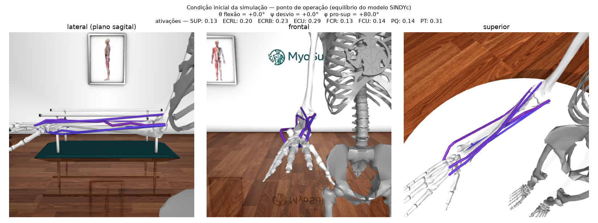
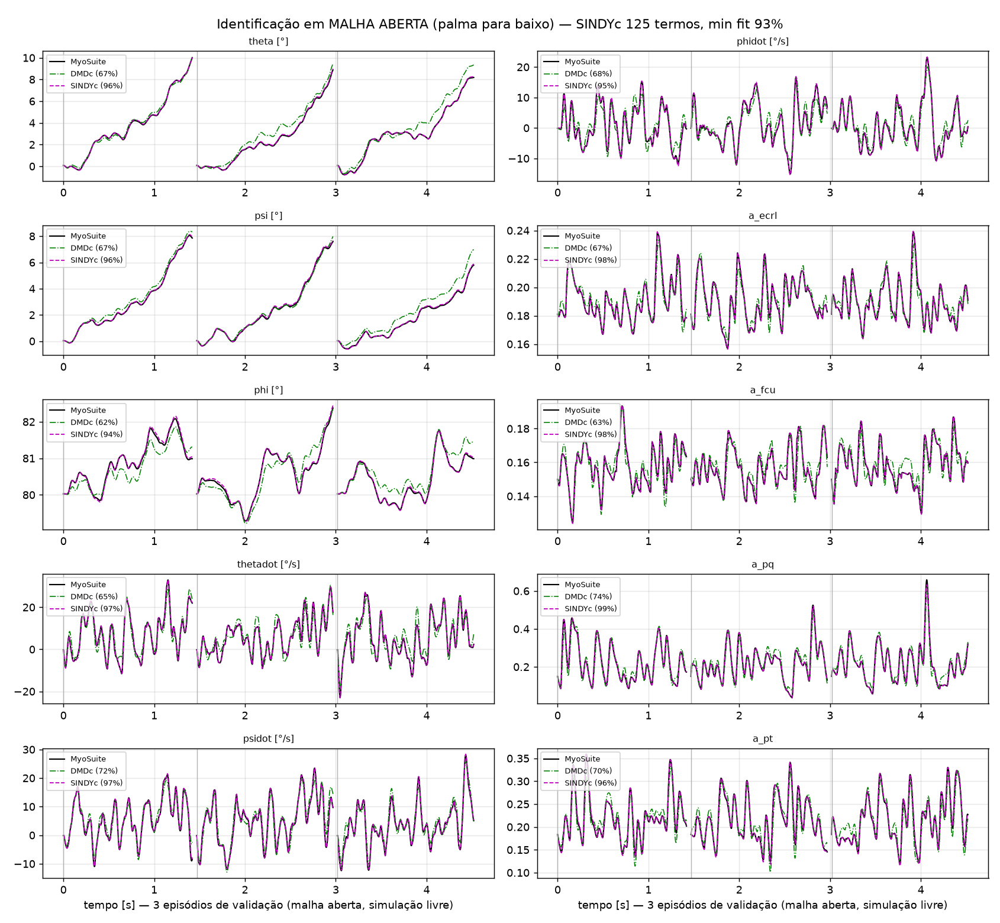
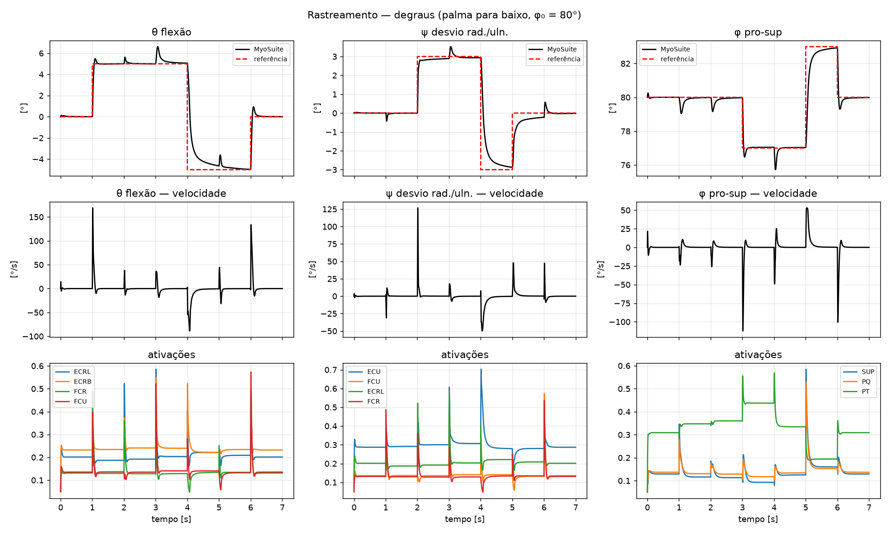
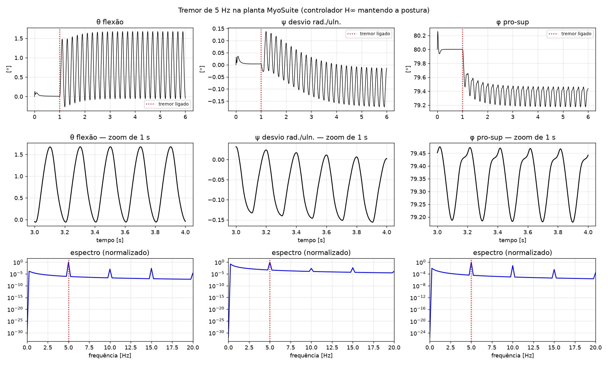

# MyoSuite Tremor Suppression Modeling (Brazil)

Modelagem e controle da dinâmica direta do punho no **MyoSuite/MuJoCo**, visando o estudo do tremor patológico.
É a reimplementação, em Python nativo, da malha de controle motor da tese de doutorado de Wellington C. Pinheiro
(PEB/COPPE/UFRJ), originalmente em MATLAB/OpenSim, **sem o oscilador de Matsuoka**:

> planta musculoesquelética → identificação (DMDc / **SINDYc**) → síntese **H∞** (mixsyn) → malha fechada → perturbação de tremor



## Notação dos graus de liberdade

| símbolo | GDL | junta no MuJoCo | sinal positivo |
|---|---|---|---|
| **θ** (theta) | flexão/extensão | `flexion` | flexão |
| **ψ** (psi) | desvio radial/ulnar | `deviation` | desvio radial |
| **φ** (phi) | pronação/supinação | `pro_sup` | pronação |

No código, os estados seguem a ordem das juntas: q = [θ, ψ, φ] em 3 GDL e q = [θ, φ] em 2 GDL. Os vetores
impressos, como RMSE [θ ψ φ], seguem essa mesma ordem.

## Estrutura

```
wrist_control/        biblioteca: planta, identificação, SINDYc, síntese H∞, malha fechada, visualizador, pipelines
scripts/              pontos de entrada numerados (ordem do desenvolvimento)
results/<estudo>/     figuras, modelos identificados e controladores de cada estudo
docs/NOTAS_TECNICAS.md  decisões de projeto, diagnósticos, artefatos do modelo e pendências
```

| script | estudo | resultados |
|---|---|---|
| `00_hand_openloop_timing.py` | MyoHand (39 músculos) em malha aberta: ângulos, ativações e tempo de execução (~9x tempo real) | `results/hand_openloop_timing/` |
| `01_wrist2dof_dmdc_hinf.py` | punho 2 GDL / 7 músculos (tese): DMDc + H∞ | `results/wrist2dof/` |
| `02_wrist2dof_sindyc_vs_dmdc.py` | SINDYc × DMDc em 2 GDL | `results/wrist2dof/` |
| `03_wrist3dof_closedloop_id.py` | [histórico] 3 GDL / 8 músculos, identificação em malha fechada | `results/wrist3dof_closedloop_id/` |
| `04_wrist3dof_compare_dmdc_sindyc.py` | [histórico] mesma síntese H∞ a partir do DMDc e do SINDYc | `results/wrist3dof_closedloop_id/` |
| **`05_wrist3dof_openloop_palmdown.py`** | **[atual]** palma para baixo: (1) SINDYc em **malha aberta**, (2) síntese H∞, (3) rastreamento, (4) tremor de 5 Hz | `results/wrist3dof_openloop_palmdown/` |
| `06_visualize.py` | condição inicial em PNG; `--gif` anima o tremor; `--interactive` abre o viewer do MuJoCo | `results/wrist3dof_openloop_palmdown/` |

## Instalação

```bash
python -m venv .venv
.venv\Scripts\python -m pip install -r requirements.txt
```

## Execução

```bash
.venv\Scripts\python scripts/05_wrist3dof_openloop_palmdown.py
.venv\Scripts\python scripts/05_wrist3dof_openloop_palmdown.py --control-only
.venv\Scripts\python scripts/06_visualize.py --gif
```

O pipeline completo do script 05 leva ~5 min, a maior parte na esparsificação do SINDYc. Com `--control-only`,
que reusa o modelo identificado salvo, leva ~40 s. Os dados brutos de identificação (`idtf_*`) não são
versionados porque os experimentos têm semente fixa e podem ser regenerados.

## Resultados atuais (3 GDL, palma para baixo: θ = 0°, ψ = 0°, φ = 80°)

| etapa | resultado |
|---|---|
| identificação SINDYc em malha aberta (60 episódios curtos, 1–15 Hz, ~2° RMS) | 125 termos, **fit mínimo de 93%** em simulação livre (DMDc: 62%); polo instável identificado de +1,42 s⁻¹ (MuJoCo: +1,34 s⁻¹) |
| síntese H∞ (W1/W3 da tese) | γ = 0,91, controlador de ordem 19 |
| rastreamento (degraus / senoides) | RMSE [θ ψ φ] = 1,1 / 0,7 / 0,6° (degraus) e 0,5 / 0,2 / 0,2° (senoides) |
| tremor de 5 Hz | 1,8° pico a pico em θ, pico espectral em 5,0 Hz |

| identificação | rastreamento | tremor |
|---|---|---|
|  |  |  |

**Limitação conhecida:** no myoArm, o tendão do supinador troca de lado no wrapping em φ = 75°, e o rastreamento
é mantido em φ ≥ 77°. Os detalhes e as opções estão em [docs/NOTAS_TECNICAS.md](docs/NOTAS_TECNICAS.md).

## Referências
- MyoSuite: https://myosuite.readthedocs.io
- Brunton, Proctor & Kutz (2016): *Sparse identification of nonlinear dynamics with control (SINDYc)*.
- Proctor, Brunton & Kutz (2016): *Dynamic mode decomposition with control*.
